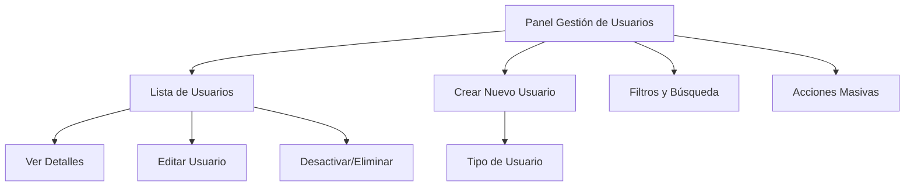

# Flujo de Creación de Usuarios - Vista del Administrador

## Interfaz del Administrador

### 1. Panel Principal de Gestión de Usuarios

#### Acceso desde el Dashboard
```
Dashboard Administrador
├── 📊 Estadísticas Generales
├── 👥 Gestión de Usuarios (activo)
├── 🏢 Gestión de Empresas
├── 📋 Reportes
└── ⚙️ Configuración
```

#### Sección "Gestión de Usuarios"


### 2. Flujo de Creación de Usuario

#### Paso 1: Selección de Tipo de Usuario
```
┌─────────────────────────────────────────┐
│         CREAR NUEVO USUARIO              │
├─────────────────────────────────────────┤
│                                         │
│  👨‍🎓 ESTUDIANTE                        │
│  └─ Crear estudiante con código automático │
│                                         │
│  👨‍🏫 DOCENTE (ASESOR/COORDINADOR)      │
│  └─ Crear docente con roles específicos  │
│                                         │
│  🏢 REPRESENTANTE DE EMPRESA            │
│  └─ Vincular a empresa existente         │
│                                         │
│  👤 ADMINISTRADOR                       │
│  └─ Crear otro administrador            │
│                                         │
└─────────────────────────────────────────┘
```

#### Paso 2: Formulario Dinámico Según Tipo

### 3. Creación de Estudiante

#### Interfaz del Formulario
```
┌─────────────────────────────────────────┐
│         CREAR ESTUDIANTE                │
├─────────────────────────────────────────┤
│                                         │
│ 📋 DATOS PERSONALES                     │
│ ┌─────────────────────────────────────┐ │
│ │ Nombre: [________________]          │ │
│ │ Apellido Paterno: [__________]     │ │
│ │ Apellido Materno: [__________]     │ │
│ │ Email: [ejemplo@unt.edu.pe]        │ │
│ │ Contraseña: [•••••••••••••]        │ │
│ │ Confirmar: [•••••••••••••]        │ │
│ └─────────────────────────────────────┘ │
│                                         │
│ 🎓 DATOS ACADÉMICOS                     │
│ ┌─────────────────────────────────────┐ │
│ │ Carrera: [Ingeniería de Sistemas ▼] │ │
│ │ Año Ingreso: [2024]                 │ │
│ │                                     │ │
│ ✅ Código universitario: AUTOGENERADO │ │
│ ✅ Escuela profesional: AUTOGENERADA  │ │
│ └─────────────────────────────────────┘ │
│                                         │
│ [Cancelar]              [Crear Estudiante] │
└─────────────────────────────────────────┘
```

#### Proceso Backend
```typescript
// 1. Validar datos del formulario
// 2. Crear usuario base
const user = await usersService.create({
  email, nombre, apellidoPaterno, apellidoMaterno, contrasenaHash
});

// 3. Generar código automático
const codigo = generarCodigoUniversitario(carrera, anioIngreso);

// 4. Crear perfil estudiante
await studentsService.create({
  usuarioId: user.id,
  carreraId,
  anioIngreso,
  codigoUniversitario: codigo,
  escuelaProfesional: obtenerEscuelaPorCarrera(carreraId)
});

// 5. Asignar rol
await usersService.assignRole(user.id, rolEstudianteId);

// 6. Enviar credenciales por email
await emailService.sendCredentials(user.email, temporaryPassword);
```

### 4. Creación de Docente (Asesor/Coordinador)

#### Interfaz del Formulario
```
┌─────────────────────────────────────────┐
│         CREAR DOCENTE                   │
├─────────────────────────────────────────┤
│                                         │
│ 📋 DATOS PERSONALES                     │
│ ┌─────────────────────────────────────┐ │
│ │ Nombre: [________________]          │ │
│ │ Apellido Paterno: [__________]     │ │
│ │ Apellido Materno: [__________]     │ │
│ │ Email: [profesor@unt.edu.pe]       │ │
│ │ Contraseña: [•••••••••••••]        │ │
│ │ Confirmar: [•••••••••••••]        │ │
│ └─────────────────────────────────────┘ │
│                                         │
│ 🏫 DATOS ACADÉMICOS                     │
│ ┌─────────────────────────────────────┐ │
│ │ Carrera: [Ingeniería de Sistemas ▼] │ │
│ │ Especialidad: [Software__________] │ │
│ │ Categoría: [Asistente ▼]           │ │
│ │ Dedicación: [Tiempo Completo ▼]    │ │
│ │ Oficina: [A-201]                   │ │
│ │ Teléfono: [123-456-789]            │ │
│ └─────────────────────────────────────┘ │
│                                         │
│ 🎭 ROLES A ASIGNAR                     │
│ ┌─────────────────────────────────────┐ │
│ │ ☑️ ASESOR (Supervisar prácticas)   │ │
│ │ ☐ COORDINADOR (Gestión académica) │ │
│ │                                     │ │
│ │ 💡 Puede asignar uno o ambos roles │ │
│ └─────────────────────────────────────┘ │
│                                         │
│ [Cancelar]                [Crear Docente] │
└─────────────────────────────────────────┘
```

#### Proceso Backend
```typescript
// 1. Crear usuario base
const user = await usersService.create(userData);

// 2. Crear perfil docente
await teachersService.create({
  usuarioId: user.id,
  carreraId,
  especialidad,
  categoria,
  dedicacion,
  oficina,
  telefono
});

// 3. Asignar roles seleccionados
if (roles.includes('ASESOR')) {
  await usersService.assignRole(user.id, rolAsesorId);
}
if (roles.includes('COORDINADOR')) {
  await usersService.assignRole(user.id, rolCoordinadorId);
}

// 4. Enviar credenciales
await emailService.sendCredentials(user.email, temporaryPassword);
```

### 5. Creación de Representante de Empresa

#### Paso 1: Selección/Creación de Empresa
```
┌─────────────────────────────────────────┐
│      VINCULAR EMPRESA                   │
├─────────────────────────────────────────┤
│                                         │
│ 🔍 BUSCAR EMPRESA EXISTENTE             │
│ ┌─────────────────────────────────────┐ │
│ │ RUC/Razón Social: [20100012345__] │ │
│ │                                     │ │
│ │ 📋 Resultados:                      │ │
│ │ ☑️ 20100012345 - SOFTWARE S.A.C.   │ │
│ │ ☐ 20100067890 - TECNOLOGÍAS S.A.C. │ │
│ └─────────────────────────────────────┘ │
│                                         │
│ ──────────────────────────────────────── │
│                                         │
│ ➕ CREAR NUEVA EMPRESA                   │
│ [Crear Nueva Empresa]                   │
│                                         │
│ [Siguiente]                             │
└─────────────────────────────────────────┘
```

#### Paso 2: Datos del Representante
```
┌─────────────────────────────────────────┐
│     CREAR REPRESENTANTE                 │
├─────────────────────────────────────────┤
│                                         │
│ 🏢 EMPRESA SELECCIONADA                  │
│ ┌─────────────────────────────────────┐ │
│ │ SOFTWARE S.A.C.                     │ │
│ │ RUC: 20100012345                     │ │
│ │ [Cambiar empresa]                    │ │
│ └─────────────────────────────────────┘ │
│                                         │
│ 📋 DATOS PERSONALES                     │
│ ┌─────────────────────────────────────┐ │
│ │ Nombre: [________________]          │ │
│ │ Apellido Paterno: [__________]     │ │
│ │ Apellido Materno: [__________]     │ │
│ │ Email: [rep@software.com]          │ │
│ │ Contraseña: [•••••••••••••]        │ │
│ │ Confirmar: [•••••••••••••]        │ │
│ └─────────────────────────────────────┘ │
│                                         │
│ 💼 DATOS LABORALES                      │
│ ┌─────────────────────────────────────┐ │
│ │ Cargo: [Gerente de RRHH________]   │ │
│ │ Departamento: [Recursos Humanos]   │ │
│ │ Teléfono Directo: [123-456-789]    │ │
│ │ ☑️ Es representante principal       │ │
│ └─────────────────────────────────────┘ │
│                                         │
│ [Cancelar]          [Crear Representante] │
└─────────────────────────────────────────┘
```

### 6. Creación de Administrador

#### Interfaz (Formulario Simplificado)
```
┌─────────────────────────────────────────┐
│       CREAR ADMINISTRADOR               │
├─────────────────────────────────────────┤
│                                         │
│ ⚠️  ACCESO RESTRINGIDO                  │
│ Solo los administradores pueden crear   │
│ otros administradores                   │
│                                         │
│ 📋 DATOS PERSONALES                     │
│ ┌─────────────────────────────────────┐ │
│ │ Nombre: [________________]          │ │
│ │ Apellido Paterno: [__________]     │ │
│ │ Apellido Materno: [__________]     │ │
│ │ Email: [admin@unt.edu.pe]          │ │
│ │ Contraseña: [•••••••••••••]        │ │
│ │ Confirmar: [•••••••••••••]        │ │
│ └─────────────────────────────────────┘ │
│                                         │
│ 🔒 PERMISOS                             │
│ ☑️ Acceso total al sistema              │
│ ☑️ Gestión de todos los usuarios        │
│ ☑️ Configuración del sistema            │
│                                         │
│ [Cancelar]           [Crear Administrador] │
└─────────────────────────────────────────┘
```

### 7. Panel de Confirmación y Resultados

#### Vista de Confirmación
```
┌─────────────────────────────────────────┐
│           ✅ USUARIO CREADO              │
├─────────────────────────────────────────┤
│                                         │
│ 👤 Juan Pérez García                    │
│ 📧 juan.perez@unt.edu.pe               │
│ 🎓 Estudiante - Ingeniería de Sistemas │
│ 🆔 Código: 2024001234                   │
│                                         │
│ ✨ Acciones realizadas:                  │
│ ✅ Usuario creado                       │
│ ✅ Perfil de estudiante generado        │
│ ✅ Rol ESTUDIANTE asignado              │
│ ✅ Credenciales enviadas por email      │
│                                         │
│ 📧 Se han enviado las credenciales a:   │
│    juan.perez@unt.edu.pe                │
│                                         │
│ [Ver Detalles] [Crear Otro] [Cerrar]    │
└─────────────────────────────────────────┘
```

### 8. Gestión Post-Creación

#### Panel de Control del Usuario
```
┌─────────────────────────────────────────┐
│           GESTIÓN DE USUARIO             │
├─────────────────────────────────────────┤
│ 👤 Juan Pérez García                    │
│ 📧 juan.perez@unt.edu.pe               │
│ 🎓 Estudiante - Activo                  │
│                                         │
│ 📊 ESTADÍSTICAS                         │
│ • Prácticas activas: 0                  │
│ • Tesis registradas: 0                  │
│ • Último login: Nunca                   │
│                                         │
│ ⚙️ ACCIONES RÁPIDAS                     │
│ [📧 Reenviar Credenciales]              │
│ [🔒 Cambiar Contraseña]                 │
│ [📝 Editar Perfil]                      │
│ [📋 Ver Historial]                      │
│                                         │
│ 🚫 ACCIONES DE SISTEMA                  │
│ [⏸️ Desactivar Usuario]                │
│ [🗑️ Eliminar Usuario]                  │
│                                         │
│ [Volver a Lista]                        │
└─────────────────────────────────────────┘
```

### 9. Funciones Adicionales del Administrador

#### Búsqueda y Filtros Avanzados
```
┌─────────────────────────────────────────┐
│           FILTROS DE BÚSQUEDA            │
├─────────────────────────────────────────┤
│                                         │
│ 🔍 Búsqueda general: [Juan Pérez__]     │
│                                         │
│ 📊 Filtrar por:                         │
│ ┌─────────────────────────────────────┐ │
│ │ Rol: [Todos ▼]                     │ │
│ │ Estado: [Todos ▼]                  │ │
│ │ Carrera: [Todas ▼]                 │ │
│ │ Fecha Creación: [Último mes ▼]     │ │
│ └─────────────────────────────────────┘ │
│                                         │
│ 📈 Ordenar por:                         │
│ ○ Nombre        ○ Email                │
│ ○ Fecha         ○ Rol                 │
│ ○ Estado        ○ Carrera              │
│                                         │
│ [Aplicar Filtros] [Limpiar]             │
└─────────────────────────────────────────┘
```

#### Acciones Masivas
```
┌─────────────────────────────────────────┐
│           ACCIONES MASIVAS               │
├─────────────────────────────────────────┤
│                                         │
│ ☑️ Seleccionados: 5 usuarios            │
│                                         │
│ 📧 Acciones:                            │
│ [Reenviar credenciales a todos]         │
│ [Activar usuarios seleccionados]        │
│ [Desactivar usuarios seleccionados]     │
│ [Exportar a Excel]                      │
│                                         │
│ 📊 Estadísticas del lote:                │
│ • Estudiantes: 3                        │
│ • Docentes: 2                           │
│ • Activos: 4                            │
│ • Inactivos: 1                          │
│                                         │
│ [Confirmar Acción]                      │
└─────────────────────────────────────────┘
```

### 10. Notificaciones y Alertas

#### Sistema de Notificaciones en Tiempo Real
```
🔔 Panel de Notificaciones
├── ✅ Usuario Juan Pérez creado exitosamente
├── 📧 Credenciales enviadas a 5 usuarios
├── ⚠️ 3 usuarios no han iniciado sesión (30 días)
├── 📊 Reporte mensual disponible
└── 🔒 Intento de acceso sospechoso detectado
```

Este flujo proporciona al administrador una interfaz completa e intuitiva para gestionar todos los aspectos de creación y administración de usuarios del sistema.
