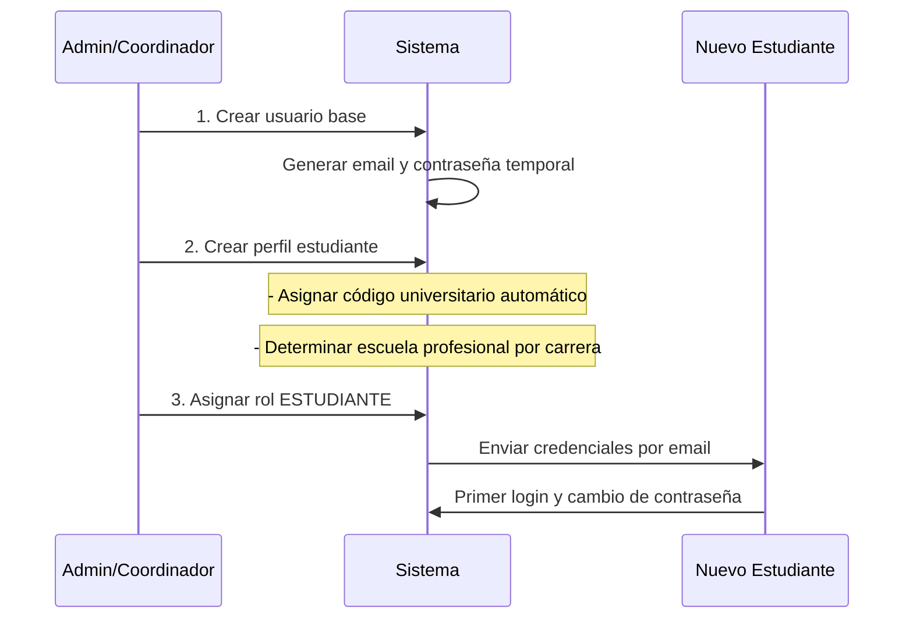
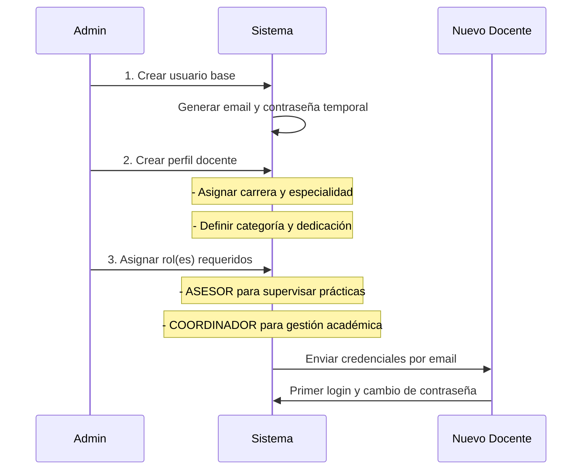
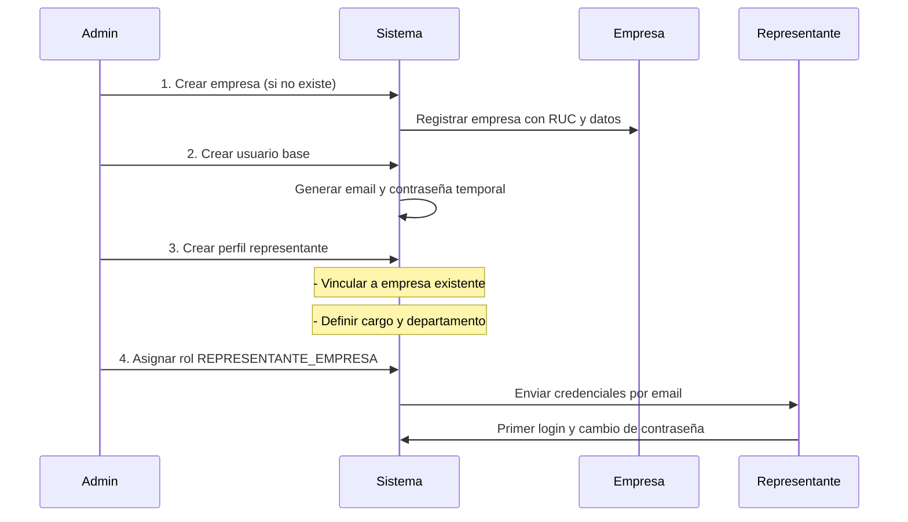
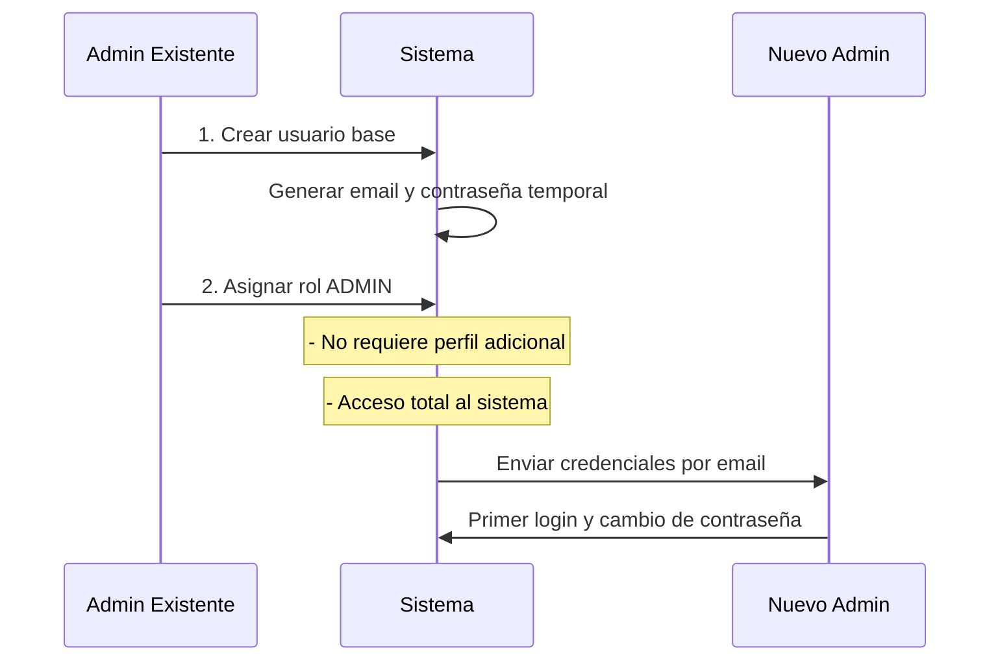

# Flujo de Gestión de Usuarios y Roles - Sistema de Prácticas y Tesis UNT

## Arquitectura Normalizada Actual

### Entidades Principales
- **usuario**: Entidad base con información común (email, contraseña, nombres, etc.)
- **rol**: Define los permisos y accesos en el sistema
- **usuario_rol**: Tabla intermedia muchos-a-muchos para asignación de roles
- **Perfiles Específicos Normalizados**:
  - **estudiante**: Perfil específico con código universitario, carrera, etc.
  - **docente**: Perfil específico con especialidad, categoría, dedicación
  - **representante_empresa**: Perfil específico vinculado a empresa

### Roles Definidos
1. **Administrador**: Control total del sistema
2. **Coordinador**: Gestión académica y administrativa
3. **Asesor**: Supervisión de prácticas y tesis (rol de docente)
4. **Estudiante**: Participantes del sistema
5. **Representante Empresa**: Gestión de ofertas y convenios

## Flujo Correcto de Gestión de Usuarios

### 1. Estudiantes

#### Proceso de Creación


#### Características del Perfil Estudiante
- **Código universitario**: Generado automáticamente por el sistema
- **Escuela profesional**: Determinada automáticamente por la carrera asignada
- **Año de ingreso**: Requerido para el registro académico
- **Carrera**: Obligatorio, define la escuela profesional

### 2. Coordinadores y Asesores (Docentes)

#### Proceso de Creación


#### Características del Perfil Docente
- **Sin perfil adicional adicional**: Solo requieren el rol asignado
- **Carrera**: Obligatorio, define su área de actuación
- **Especialidad**: Campo opcional para área específica
- **Categoría**: Auxiliar, Asistente, Asociado, Principal
- **Dedicación**: Tiempo Completo, Medio Tiempo

#### Múltiples Roles para Docentes
- Un docente puede tener rol **ASESOR** únicamente
- Un docente puede tener rol **COORDINADOR** únicamente  
- Un docente puede tener ambos roles **ASESOR + COORDINADOR**
- Los permisos se acumulan según los roles asignados

### 3. Representantes de Empresa

#### Proceso de Creación


#### Características del Perfil Representante
- **Empresa requerida**: Debe existir la empresa primero
- **Vínculo directo**: FK a empresa.id
- **Cargo**: Posición en la empresa
- **Departamento**: Área de responsabilidad
- **Principal**: Indica si es el representante principal

### 4. Administradores

#### Proceso de Creación


#### Características del Administrador
- **Acceso total**: Control completo del sistema
- **Sin perfil adicional**: Solo requieren el rol ADMIN
- **Creación restringida**: Solo otros admins pueden crear admins
- **Permisos inherit**: Heredan todos los permisos de otros roles

### 5. Flujo de Creación Resumido

#### Orden de Operaciones por Tipo de Usuario

**Estudiante:**
1. Crear usuario base
2. Crear perfil estudiante (código automático)
3. Asignar rol ESTUDIANTE

**Coordinador/Asesor:**
1. Crear usuario base  
2. Crear perfil docente
3. Asignar rol(es) ASESOR/COORDINADOR

**Representante Empresa:**
1. Crear empresa (si no existe)
2. Crear usuario base
3. Crear perfil representante (vinculado a empresa)
4. Asignar rol REPRESENTANTE_EMPRESA

**Administrador:**
1. Crear usuario base
2. Asignar rol ADMIN
3. Sin perfil adicional

### 6. Validaciones y Restricciones

#### En la Base de Datos
- **usuario_id** es UNIQUE en todas las tablas de perfil
- **FKs** aseguran integridad referencial
- **DELETE CASCADE** en usuario elimina perfiles relacionados
- **Roles** asignados través de tabla intermedia usuario_rol

#### En la Aplicación
- Un usuario solo puede tener UN perfil específico
- Un usuario puede tener MÚLTIPLES roles
- Los perfiles son obligatorios según el rol principal
- Validación de existencia de empresa para representantes

### 7. Endpoints Actualizados

#### Gestión de Usuarios (Admin)
```typescript
// Creación por tipo de usuario
POST /api/users/student - Crear estudiante completo
POST /api/users/teacher - Crear docente completo  
POST /api/users/representative - Crear representante completo
POST /api/users/admin - Crear administrador

// Gestión de empresas (previo a representante)
POST /api/companies - Crear empresa
GET /api/companies - Listar empresas
```

#### Estructura de DTOs
```typescript
// Estudiante
createStudentDto: {
  user: CreateUserDto;
  student: {
    carreraId: number;
    anioIngreso: number;
    // código y escuela se generan automáticamente
  };
}

// Docente  
createTeacherDto: {
  user: CreateUserDto;
  teacher: {
    carreraId: number;
    especialidad?: string;
    categoria?: string;
    dedicacion?: string;
  };
  roles: RoleName[]; // ['ASESOR'] | ['COORDINADOR'] | ['ASESOR', 'COORDINADOR']
}

// Representante
createRepresentativeDto: {
  user: CreateUserDto;
  representative: {
    empresaId: number;
    cargo: string;
    departamento?: string;
    esPrincipal?: boolean;
  };
}
```

### 8. Ventajas del Flujo Normalizado

- **Integridad referencial**: FKs aseguran consistencia
- **Separación de responsabilidades**: Perfiles específicos por rol
- **Escalabilidad**: Fácil agregar nuevos tipos de usuario
- **Auditoría**: Relaciones claras y trazables
- **Flexibilidad**: Múltiples roles por usuario
- **Automatización**: Generación automática de códigos y datos derivados

Este flujo garantiza consistencia total con la estructura de base de datos normalizada y elimina la necesidad de perfiles adicionales para roles que no los requieren.
